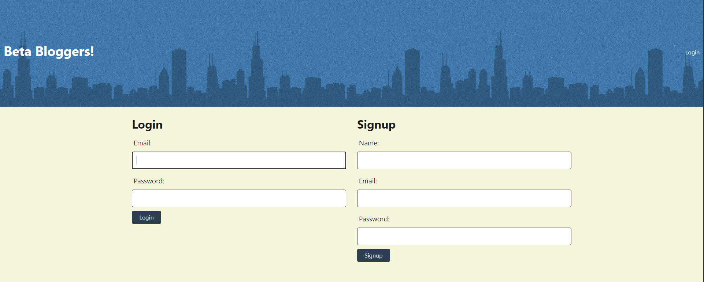
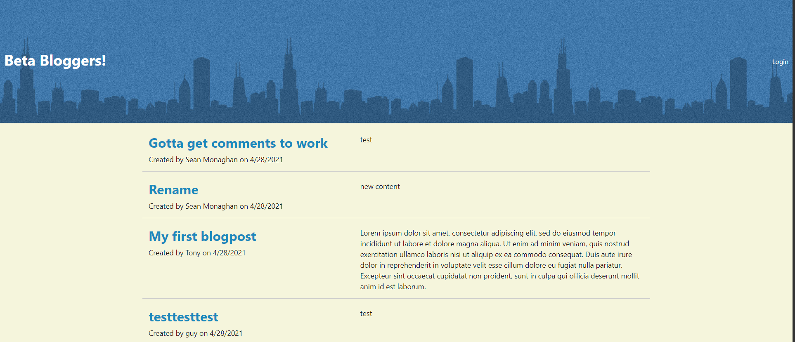
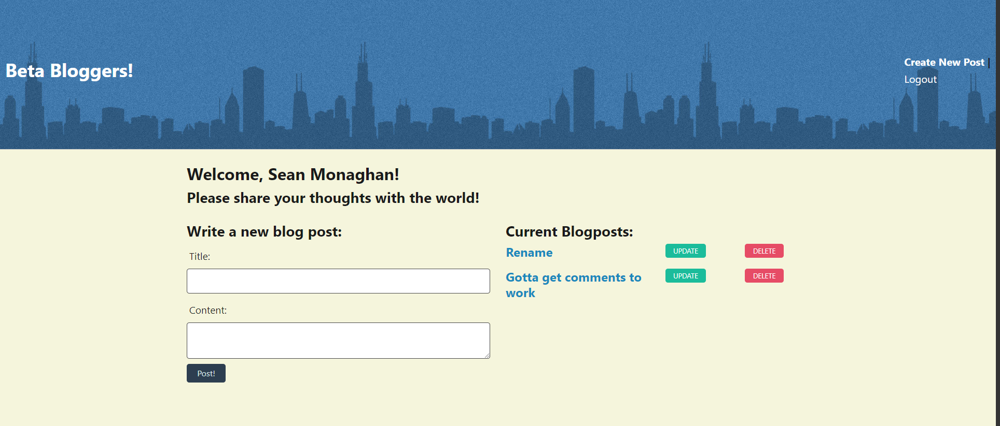
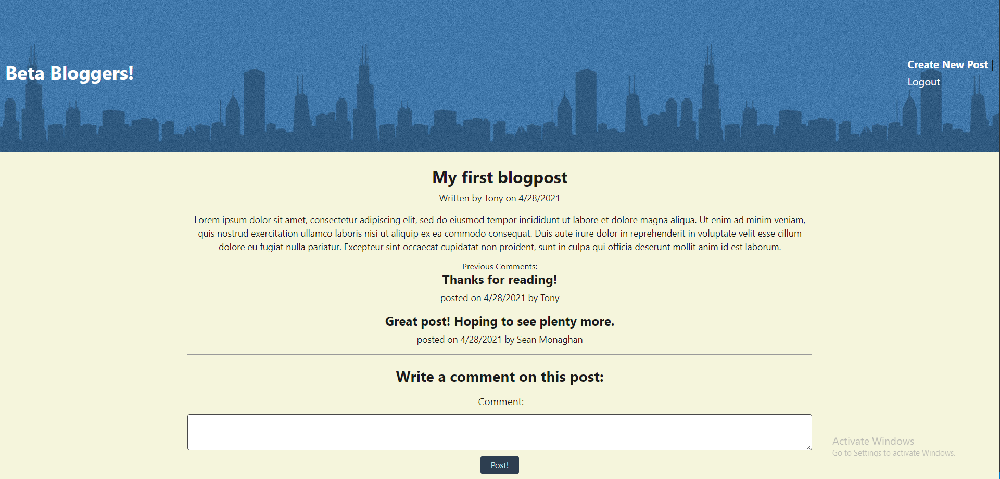

# Tech Blog

[Description](#description) 

[Installation Instructions](#installation-instructions) 

[Site Overview](#site-overview) 
  

[Contribution Guidelines](#contribution-guidelines) 

[Tests](#tests) 
 
[Questions](#questions)

## Description

This blog serves as a website where developers can interact with one another and share their experiences coding and developing software in a friendly environment.  Users are able to create whatever kind of posts they want and engage in intellectual exchanges with their peers.  By allowing for this forum of discourse, it is the hope that developers of all skill levels will continue to develop their craft.

This blog follows the MVC paradigm in its architectural structure, uses Handlebars.js as the templating language, Sequelize as the ORM and the express-session npm package for authentication.  It is also developed using Javascript, HTML5 and CSS3.

## Installation Instructions

There is no need to install this blog as it is hosted live on Heroku!  The link is at the top of this README.

## Site Overview

This website is designed to be as streamlined as possible for a good user experience.  Upon visiting the site, you are presented with the beautiful blog posts of every developer who has decided to use this platform to share their experiences in descending order of when they have been posted.  

Upon visiting the site, you will not be able to interact with anything or make a blog post until you have logged in, which can be easily done by clicking the 'login' button on the top right of the screen.  You can either log in with an existing account or register a new one with a unique email address.

If you click the homepage button as indicated by the name of the blog, you will be brought back to the homepage.  When you click on an existing post, you are able to see the post title, content, post creator's username, and the date that the post was created.  You are also invited to leave a positive comment regarding that persons post.  The comment is saved and displayed along with your username and the date the post was created.  

When you click on the link in the top right to Create a Post, it will present you on the right with all of the posts you have made previously and the option to delete or update them.  If you want to create a new post, you can fill out the form on the left hand side of the screen and hit post.  Similarly, if you want to update an existing post, you can enter text into the create a post form and click "update" on the post you want to update to the right and it will update that post with the information you have entered in the form.  

Finally, when you are able to tear yourself away from this blog, you can hit logout and it will end your session.  Alternatively, you can linger and idle for 15 minutes where the blog will take matters into it's own hands and forcibly end your session.  But the blog will be there, patiently waiting for you to return.

## License

This application uses the MIT license

## Contribution Guidelines

If you would like to contribute to this project feel free to send requests.  I only wish that you be respectful to other contributes and to the code itself and maintain good clean coding practices. 

### Questions

If you have any questions about the application, be sure to contact me at my [e-mail](mailto:smonagha@conncoll.edu).

Alternatively you can find me and my other works at my [Github account](https://github.com/seanmonaghan).